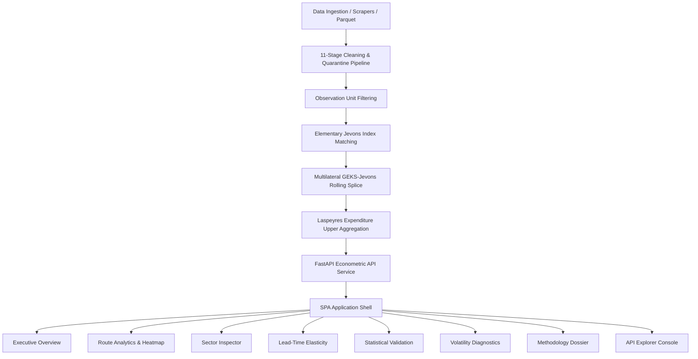

# AIPI — Real-Time Airfare Price Index for India

**Smart India Hackathon (SIH 2026)** · Problem Statement **26056**  
**Ministry of Statistics and Programme Implementation (MoSPI)**

A production-grade, methodologically defensible, real-time price index decision support system for Indian domestic airfares, built to international statistical standards (IMF, ILO, Eurostat) as a candidate component for the Consumer Price Index (CPI).

---

## Table of Contents

1. [Project Overview](#project-overview)
2. [Problem Statement & Core Challenges](#problem-statement--core-challenges)
3. [Key Methodological Foundations](#key-methodological-foundations)
4. [Platform Features](#platform-features)
5. [Technology Stack](#technology-stack)
6. [Architecture Overview](#architecture-overview)
7. [Backend API Surface](#backend-api-surface)
8. [Repository Directory Structure](#repository-directory-structure)
9. [Installation & Prerequisites](#installation--prerequisites)
10. [Running Backend & Frontend](#running-backend--frontend)
11. [Environment Variables](#environment-variables)
12. [Testing & Quality Verification](#testing--quality-verification)
13. [Deployment Guide](#deployment-guide)
14. [Security & Data Integrity](#security--data-integrity)
15. [Accessibility (WCAG 2.1 AA)](#accessibility-wcag-21-aa)
16. [Documentation Directory](#documentation-directory)
17. [License](#license)

---

## Project Overview

Airfares are among the most dynamic and volatile consumption segments in modern economies, characterized by real-time algorithmic yield management, advance-purchase price curves, code-sharing, flight-schedule churn, and seasonality. 

Traditional statistical collection methods (such as single-day monthly field surveys) suffer from severe measurement error and direction-of-change inaccuracies when applied to dynamic airfares. 

**AIPI (Airfare Price Index for India)** solves this by implementing an end-to-end econometric collection, cleaning, multi-lateral aggregation, and decision support platform. It delivers daily, weekly, and monthly headline inflation metrics backed by mathematical proofs of transitivity and drift removal.

---

## Problem Statement & Core Challenges

**MoSPI Problem Statement 26056**: Development of a candidate CPI sub-index for domestic passenger air transportation.

### Quantified Measurement Error of Sparse Sampling
From Monte Carlo simulations of sparse collection against daily ground truth:
- **1 day/month collection**: Carries an average Mean Absolute Error (MAE) of **1.57%** (3.60% at 95th percentile) and reports the **WRONG DIRECTION** of month-on-month movement **27.1%** of the time.
- **3 days/month collection**: Reduces MAE to **< 1.0%** (0.849% MAE, 11.6% direction error).
- **Daily collection (AIPI)**: Achieves **0.0% direction error** and full market price path fidelity.

---

## Key Methodological Foundations

1. **Expenditure-Weighted Laspeyres Aggregation ($p_0 q_0 / \sum p_0 q_0$)**:  
   Uses base-period passenger counts multiplied by base-period fares rather than naive passenger count weights ($q_0 / \sum q_0$). Weighting by passenger counts alone assumes homogeneous fares across long-haul and short-haul sectors, introducing up to 25 index points of distortion.
2. **Jevons on Price Relatives (Geometric Mean of Price Relatives)**:  
   Computes elementary price relatives of matched flight numbers before taking geometric means, avoiding schedule churn bias where route entry/exit of low-cost carriers distorts price level geometric means by > 1.19%.
3. **Multilateral GEKS-Jevons with Rolling Window Movement Splice**:  
   Eliminates chain drift over non-overlapping carrier flight schedules using a 25-day rolling window with an unrevised movement splice. Removes up to 2.55% cumulative drift.
4. **14-Day Geometric Mean Base Period**:  
   Anchors base levels ($100.0$) to a 14-day geometric mean window rather than a single arbitrary day, eliminating baseline noise injection.
5. **Standardized Observation Unit**:  
   Pinned to: 1 Adult, Economy, Non-Stop, One-Way, Lowest Fare within a single brand family, Total Payable (INR inclusive of fuel surcharge and taxes), excluding codeshares and ancillaries.

---

## Platform Features

1. **Executive Inflation Monitor (Overview)**:  
   Real-time headline AIPI index tracking daily, weekly, and monthly frequencies with optional multiplicative Day-of-Week (DoW) seasonal adjustment.
2. **Sector Intelligence & Route Analytics**:  
   Interactive 2D sector-date inflation dispersion heatmap matrix across the 12 primary domestic routes, with real-time expenditure weight indicators.
3. **Sector Trajectory Inspector**:  
   Deep-dive single-sector trajectory curves and chronological matched quote logs.
4. **Advance Booking Elasticity (Lead-Time Analysis)**:  
   Dynamic yield curve tracking relative price levels from T+1 (walk-up departure) to T+45 (early bird) normalized to $T+14 = 100.0$.
5. **Statistical Validation & DGCA Benchmark**:  
   Rigorous back-testing against DGCA historical benchmarks computing Pearson $r$, Spearman $\rho$, MAPE, and directional accuracy with strict $N \ge 8$ threshold reporting.
6. **Volatility & Sparse-Sampling Diagnostics**:  
   Day-on-day volatility standard deviations, intraday CV by advance window, and Monte Carlo sampling requirement curves.
7. **Official Methodology Specification & Governance Dossier**:  
   Full mathematical formula accounting, IMF/ILO compliance specifications, 11-stage data cleaning row accounting, and cryptographic SHA-256 pipeline fingerprinting.
8. **Interactive API Explorer & Contract Inspector**:  
   Real-time technical console displaying live JSON schemas, error envelopes, and parameter inspection for all 12 backend endpoints.

---

## Technology Stack

- **Backend / Econometric Engine**: Python 3.12, FastAPI, Pydantic v2, Uvicorn, NumPy, SciPy, Pandas.
- **Frontend Architecture**: Native ES Modules (JavaScript) with 100% strict TypeScript types (`src/**/*.ts`), CSS Custom Properties Design System (tokens, reset, typography, layout, global).
- **Visualization Components**: Native SVG Time-Series Charts, 2D Vector Heatmap Matrix, Elasticity Curve Charts, Accessible High-Density Data Tables.
- **Testing & Tooling**: Pytest (backend), TypeScript (`tsc --noEmit`), Node.js ES module syntax validators.

---

## Architecture Overview



---

## Backend API Surface

| Method | Endpoint | Purpose | Consuming Screen |
| :--- | :--- | :--- | :--- |
| `GET` | `/health` | Live service health, data age, and demo mode indicator | Topbar & Shell |
| `GET` | `/openapi.json` | Live OpenAPI 3.1 schema specification | API Explorer |
| `GET` | `/api/v1/pipeline-run` | Active pipeline execution run ID and git commit provenance | Sidebar, Overview, Methodology |
| `GET` | `/api/v1/methodology` | Index formulae, route expenditure weights, cleaning accounting | Methodology |
| `GET` | `/api/v1/routes` | Active 12-route domestic basket metadata | Route Analytics |
| `GET` | `/api/v1/index` | Headline composite AIPI index (daily/weekly/monthly/DoW) | Executive Overview |
| `GET` | `/api/v1/index/routes` | Route-level latest index points and expenditure weights | Route Analytics |
| `GET` | `/api/v1/index/routes/{route_code}` | Single sector chronological price index trajectory | Sector Inspector |
| `GET` | `/api/v1/index/routes/heatmap` | 2D sector $\times$ date index matrix | Route Analytics |
| `GET` | `/api/v1/index/leadtime` | Inflation time-series across advance booking horizons | Lead-Time Analysis |
| `GET` | `/api/v1/index/leadtime/curve` | Empirical fare level elasticity curve ($T+14 = 100$) | Lead-Time Analysis |
| `GET` | `/api/v1/index/volatility` | Volatility std dev, intraday CV, and Monte Carlo sampling MAE | Volatility |
| `GET` | `/api/v1/validation/dgca` | DGCA benchmark correlation ($r$, $\rho$, MAPE, direction) | Statistical Validation |

---

## Repository Directory Structure

```
.
├── README.md                           # Master project documentation
├── pyproject.toml                      # Python package configuration & dependencies
├── Dockerfile                          # Production container specification
├── docker-compose.yml                  # One-command orchestration
├── aipi/                               # AIPI Core Python Package
│   ├── basket.py                       # 12-route basket & observation unit definitions
│   ├── cleaning/                       # 11-stage cleaning & quarantine pipeline
│   ├── index/                          # Elementary Jevons, GEKS, Laspeyres, Frequency engines
│   ├── validation/                     # DGCA backtest & Monte Carlo measurement error
│   ├── provenance.py                   # Run lineage, config hashes, fingerprints
│   ├── store.py                        # SnapshotStore & IndexStore protocol
│   └── api/                            # FastAPI routes, schemas, dependencies, main app
├── dashboard/                          # Decision Support Frontend
│   ├── index.html                      # Single page application entry point
│   ├── tsconfig.json                   # Strict TypeScript compiler verification
│   └── src/
│       ├── app.js / app.ts             # SPA root router & orchestrator
│       ├── api/                        # HTTP client with AbortController & error mapping
│       ├── components/                 # StatCard, TimeSeriesChart, SectorHeatmap, EnterpriseTable...
│       ├── layouts/                    # AppShell, Topbar, Sidebar, ContentContainer
│       ├── pages/                      # All 8 feature screens (.js and .ts parity)
│       ├── styles/                     # Design tokens, reset, typography, layout, global.css
│       └── utils/                      # DOM helpers, tabular numeral formatters
├── docs/                               # Detailed technical dossiers & guides
│   ├── SYSTEM_ARCHITECTURE.md          # In-depth architectural & state specification
│   ├── API_DOCUMENTATION.md            # Comprehensive endpoint contracts & schemas
│   ├── USER_MANUAL.md                  # MoSPI operational guide
│   ├── DEPLOYMENT_GUIDE.md             # Enterprise container & security deployment
│   ├── TESTING_REPORT.md               # 155-test verification report
│   ├── SIH_PRESENTATION_CONTENT.md     # SIH Grand Finale presentation deck
│   └── SIH_DEMO_SCRIPT.md              # 8-10 minute presentation & demo walkthrough
├── scripts/                            # Pipeline seeders, runners, schema exporters
└── tests/                              # 156-item automated pytest suite
```

---

## Installation & Prerequisites

### Prerequisites
- Python 3.12+
- Node.js 18+ (for development type-checking)
- Docker & Docker Compose (optional for containerized execution)

### Setup Steps
```bash
# Clone the repository
git clone https://github.com/Rawahahruk04/sih.git
cd sih

# Create Python virtual environment and install package
python -m venv .venv
source .venv/bin/activate  # On Windows: .venv\Scripts\activate
pip install -e ".[dev]"
```

---

## Running Backend & Frontend

### Option A: Standard Local Execution (Recommended)
Starting the FastAPI server boots the backend econometric store and serves the static frontend SPA directly:
```bash
python -m uvicorn aipi.api.main:app --host 127.0.0.1 --port 8000
```
- **Intelligence Platform**: [http://127.0.0.1:8000/dashboard/](http://127.0.0.1:8000/dashboard/)
- **Interactive OpenAPI Documentation**: [http://127.0.0.1:8000/docs](http://127.0.0.1:8000/docs)
- **Health Check & Provenance**: [http://127.0.0.1:8000/health](http://127.0.0.1:8000/health)

### Option B: Docker Compose
```bash
docker compose up --build
```

---

## Environment Variables

| Variable | Default | Purpose |
| :--- | :--- | :--- |
| `AIPI_ENV` | `development` | Runtime environment (`development`, `production`, `testing`) |
| `AIPI_PORT` | `8000` | HTTP port for Uvicorn |
| `AIPI_HOST` | `0.0.0.0` | Bind host interface |
| `DATABASE_URL` | `None` | PostgreSQL connection URI (falls back to memory SnapshotStore if omitted) |
| `FRONTEND_ORIGINS` | `http://localhost:5173,http://127.0.0.1:8000` | Allowed CORS origins for external API clients |

---

## Testing & Quality Verification

### 1. Backend Econometric & API Test Suite
```bash
python -m pytest -v
```
- **155 Passed, 1 Skipped, 0 Failed** across aggregation, elementary index, GEKS transitivity, DGCA isolation, and scraping heuristics.

### 2. Frontend Strict TypeScript Compilation
```bash
npx -p typescript tsc --noEmit -p dashboard
```
- **0 Type Errors** across all `.ts` components, layouts, and page controllers.

### 3. JavaScript ES Module Syntax Validation
```bash
Get-ChildItem -Path dashboard/src -Filter *.js -Recurse | ForEach-Object { node --check $_.FullName }
```
- **0 Syntax Errors** across all client runtime scripts.

---

## Deployment Guide

For high-availability government production deployments (Nginx, Gunicorn/Uvicorn workers, SSL termination, and PostgreSQL connection pooling), refer to [`docs/DEPLOYMENT_GUIDE.md`](docs/DEPLOYMENT_GUIDE.md).

---

## Security & Data Integrity

- **Strict Data Provenance**: Zero mock metrics or client-invented numbers. Every displayed figure links to a cryptographic `run_id` and git SHA.
- **XSS & HTML Injection Protection**: All dynamic strings rendered in the DOM pass through deterministic `escapeHtml` sanitization.
- **AbortController Invariant**: In-flight HTTP requests are automatically cancelled on navigation or filter changes to prevent race conditions.
- **Read-Only Inspection**: Client interface is strictly non-mutating (GET operations only).

---

## Accessibility (WCAG 2.1 AA)

- Full keyboard navigation across all interactive tables, filters, and charts.
- Semantic HTML5 landmarks (`<header>`, `<aside>`, `<main>`, `<nav>`, `role="region"`, `role="grid"`).
- Hidden accessible data tables (`.sr-only`) backing all SVG vector charts.
- Dynamic `aria-sort` column management and SPA route heading focus announcement.
- High-contrast government color palette compliant with 4.5:1 contrast ratios.

---

## Documentation Directory

- 📐 **[System Architecture](docs/SYSTEM_ARCHITECTURE.md)**: Deep-dive architecture and lifecycle diagrams.
- 🔌 **[API Documentation](docs/API_DOCUMENTATION.md)**: Full REST contract and schema specification.
- 📖 **[User Manual](docs/USER_MANUAL.md)**: Operational guide for MoSPI statistical officers.
- 🚀 **[Deployment Guide](docs/DEPLOYMENT_GUIDE.md)**: Production containerization and security checklist.
- 🧪 **[Testing Report](docs/TESTING_REPORT.md)**: Complete test execution audit and validation results.
- 📊 **[SIH Presentation Content](docs/SIH_PRESENTATION_CONTENT.md)**: Slide deck text and narrative structure.
- 🎙️ **[SIH Demo Script](docs/SIH_DEMO_SCRIPT.md)**: 8–10 minute grand finale judging presentation script.

---

## License

Developed for the **Smart India Hackathon (SIH 2026)** for the **Ministry of Statistics and Programme Implementation (MoSPI)** under the MIT License.
