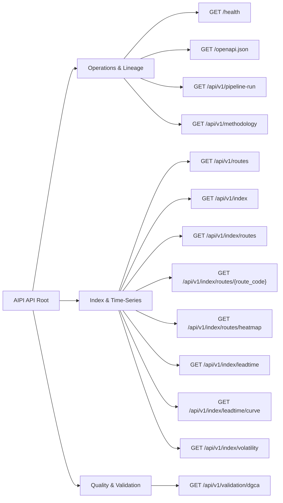

# AIPI REST API Specification & Contract Reference

**Airfare Price Index for India (AIPI)**  
*Smart India Hackathon 2026 · Problem Statement 26056 · Ministry of Statistics and Programme Implementation (MoSPI)*

---

## 1. Overview & Protocol Standards

The AIPI API delivers high-frequency econometric index series, data quality diagnostics, methodology specifications, and cryptographic provenance stamps.

- **Base URL**: `/` or `/api/v1`
- **Protocol**: HTTP/1.1 & HTTP/2 over TLS
- **Content-Type**: `application/json; charset=utf-8`
- **Standard Error Envelope**: All 4xx/5xx responses return a uniform JSON schema:
  ```json
  {
    "error": "string_error_code",
    "detail": "Human-readable explanation of the error."
  }
  ```

---

## 2. API Endpoint Catalog



---

## 3. Comprehensive Endpoint Specifications

### 3.1 `GET /health`
- **Purpose**: Verifies service reachability, warmed index availability, pipeline version, data age, and data mode (real vs demo).
- **Consuming Screens**: Topbar, AppShell, API Explorer.
- **Query Parameters**: None.
- **Response Schema (`200 OK`)**:
  ```json
  {
    "status": "ok",
    "data_available": true,
    "latest_index_date": "2026-08-14",
    "code_version": "0.1.0",
    "data_mode": {
      "counts": {
        "synthetic": 35088
      },
      "total_rows": 35088,
      "real_share": 0.0,
      "synthetic_share": 1.0,
      "is_demo_data": true,
      "banner": "Contains simulated data — not a measurement of real airfares."
    },
    "hours_since_latest_index": 312.0
  }
  ```
- **Error Responses**:
  - `500 Internal Server Error`: Critical engine failure.

---

### 3.2 `GET /openapi.json`
- **Purpose**: Returns the live, dynamically generated OpenAPI 3.1 specification for the running FastAPI instance.
- **Consuming Screens**: API Explorer Console.
- **Query Parameters**: None.
- **Response Schema (`200 OK`)**: OpenAPI 3.1 JSON Object.

---

### 3.3 `GET /api/v1/pipeline-run`
- **Purpose**: Returns cryptographic execution metadata, git commit hash, configuration SHA-256, and input row counts for the active calculation vintage.
- **Consuming Screens**: Sidebar Footer, Executive Overview, Methodology Dossier, API Explorer.
- **Query Parameters**: None.
- **Response Schema (`200 OK`)**:
  ```json
  {
    "run_id": "1aa741199ee6b8b3",
    "code_version": "0.1.0",
    "git_sha": "eb687dd1cfa030046d20004eee49aa03cdc7814a",
    "config_hash": "1767144304d288880b303b6d6fd2cd972acf09ba8e348db0fd5aedb07865413c",
    "input_row_count": 42248,
    "index_eligible_rows": 35088,
    "created_at": "2026-08-27T04:17:26.042387+00:00"
  }
  ```
- **Error Responses**:
  - `503 Service Unavailable`: `{"error": "not_ready", "detail": "No index data available yet."}`

---

### 3.4 `GET /api/v1/methodology`
- **Purpose**: Returns complete mathematical formula definitions, 11-stage cleaning accounting, route expenditure weights, base period parameters, and fingerprint hashes.
- **Consuming Screens**: Methodology Dossier, API Explorer.
- **Query Parameters**: None.
- **Response Schema (`200 OK`)**:
  ```json
  {
    "title": "Real-Time Airfare Price Index for India (AIPI)",
    "disclaimer": "Methodology proof of concept for SIH 2026 PS 26056 (MoSPI).",
    "index_number": "Laspeyres (upper) over rolling GEKS-Jevons (elementary)",
    "fingerprint": {
      "geks_window_days": 25,
      "mad_trim_k": 3.5
    },
    "base_period": {
      "start": "2026-07-01",
      "end": "2026-07-14",
      "n_days": 14,
      "definition": "Geometric mean over 14-day window = 100.0"
    },
    "diagnostics": {
      "geks_drift_removed_pct": 1.86,
      "max_geks_drift_removed_pct": 2.55,
      "laspeyres_vs_passenger_gap_pts": 0.319
    },
    "route_weights": {
      "DEL-BOM": 0.1845,
      "BOM-BLR": 0.1210
    },
    "cleaning": {
      "input_rows": 42248,
      "rows_quarantined": 7160,
      "index_eligible_rows": 35088,
      "retention_pct": 83.1,
      "quarantine_reasons": {
        "codeshare_duplicate": 3200,
        "mad_outlier_fare": 412
      }
    },
    "notes": []
  }
  ```
- **Error Responses**:
  - `503 Service Unavailable`: `{"error": "not_ready", "detail": "No index data available yet."}`

---

### 3.5 `GET /api/v1/routes`
- **Purpose**: Lists all active domestic route dimensions (origin, destination, display name, distance, and direction) for UI selector controls.
- **Consuming Screens**: Route Analytics, API Explorer.
- **Query Parameters**: None.
- **Response Schema (`200 OK`)**:
  ```json
  {
    "count": 12,
    "routes": [
      {
        "route_code": "DEL-BOM",
        "origin": "DEL",
        "destination": "BOM",
        "display_name": "Delhi - Mumbai",
        "distance_km": 1148,
        "is_metro_metro": true
      }
    ]
  }
  ```

---

### 3.6 `GET /api/v1/index`
- **Purpose**: Returns the composite national headline AIPI time series with optional frequency aggregation, date range slicing, and Day-of-Week seasonal adjustment.
- **Consuming Screens**: Executive Overview, API Explorer.
- **Query Parameters**:
  | Parameter | Type | Required | Default | Validation Rule |
  | :--- | :--- | :--- | :--- | :--- |
  | `freq` | `string` | No | `daily` | Must be `daily`, `weekly`, or `monthly`. |
  | `dow_adjusted` | `boolean` | No | `false` | **Only valid when `freq=daily`**. Non-daily + `true` returns HTTP 422. |
  | `from` | `string` (date) | No | `None` | ISO date format (`YYYY-MM-DD`). |
  | `to` | `string` (date) | No | `None` | ISO date format (`YYYY-MM-DD`). |
- **Response Schema (`200 OK`)**:
  ```json
  {
    "series": "AIPI_HEADLINE",
    "freq": "daily",
    "dow_adjusted": false,
    "base_period": {
      "start": "2026-07-01",
      "end": "2026-07-14"
    },
    "pipeline_run": { "run_id": "1aa741199ee6b8b3" },
    "data_mode": { "is_demo_data": true },
    "count": 45,
    "points": [
      {
        "date": "2026-08-14",
        "value": 104.28,
        "n_obs": 1240,
        "coverage_pct": 100.0,
        "matched_n": 412,
        "is_complete": true
      }
    ]
  }
  ```
- **Error Responses**:
  - `422 Unprocessable Entity`: `{"error": "invalid_request", "detail": "dow_adjusted is only supported for freq='daily'"}`
  - `503 Service Unavailable`: `{"error": "not_ready", "detail": "No index data available yet."}`

---

### 3.7 `GET /api/v1/index/routes`
- **Purpose**: Returns summary status, expenditure weights, latest index values, and latest observation dates for all 12 domestic routes in the basket.
- **Consuming Screens**: Route Analytics Master Table.
- **Query Parameters**: None.
- **Response Schema (`200 OK`)**:
  ```json
  {
    "pipeline_run": { "run_id": "1aa741199ee6b8b3" },
    "count": 12,
    "routes": [
      {
        "route_code": "DEL-BOM",
        "display_name": "Delhi - Mumbai",
        "weight": 0.1845,
        "latest_date": "2026-08-14",
        "latest_value": 105.12,
        "count": 45
      }
    ]
  }
  ```

---

### 3.8 `GET /api/v1/index/routes/{route_code}`
- **Purpose**: Deep-dive single-sector trajectory curves and chronological matched quote logs for a specific city pair.
- **Consuming Screens**: Sector Inspector (Route Detail).
- **Path Parameters**:
  | Parameter | Type | Required | Description |
  | :--- | :--- | :--- | :--- |
  | `route_code` | `string` | Yes | 6-character route code (e.g. `DEL-BOM`). |
- **Response Schema (`200 OK`)**:
  ```json
  {
    "route_code": "DEL-BOM",
    "display_name": "Delhi - Mumbai",
    "weight": 0.1845,
    "pipeline_run": { "run_id": "1aa741199ee6b8b3" },
    "count": 45,
    "points": [
      {
        "date": "2026-08-14",
        "value": 105.12,
        "n_obs": 180,
        "coverage_pct": 100.0,
        "is_complete": true
      }
    ]
  }
  ```
- **Error Responses**:
  - `404 Not Found`: `{"error": "unknown_route", "detail": "Unknown route: XYZ-ABC"}`

---

### 3.9 `GET /api/v1/index/routes/heatmap`
- **Purpose**: Returns a pre-shaped 2D route $\times$ date matrix for visual dispersion heatmap rendering.
- **Consuming Screens**: Route Analytics 2D Heatmap.
- **Query Parameters**:
  | Parameter | Type | Required | Description |
  | :--- | :--- | :--- | :--- |
  | `from` | `string` (date) | No | Optional starting date filter. |
  | `to` | `string` (date) | No | Optional ending date filter. |
- **Response Schema (`200 OK`)**:
  ```json
  {
    "routes": ["DEL-BOM", "BOM-BLR"],
    "route_names": ["Delhi - Mumbai", "Mumbai - Bengaluru"],
    "dates": ["2026-08-13", "2026-08-14"],
    "matrix": [
      [104.2, 105.1],
      [98.4, null]
    ],
    "value_min": 92.5,
    "value_max": 114.8,
    "baseline": 100.0,
    "note": "null indicates no matched observations in period."
  }
  ```

---

### 3.10 `GET /api/v1/index/leadtime`
- **Purpose**: Returns separate inflation index time series broken down by advance booking horizons (T+1, T+7, T+14, T+30, T+45).
- **Consuming Screens**: Booking Lead-Time Analysis.
- **Query Parameters**: None.
- **Response Schema (`200 OK`)**:
  ```json
  {
    "note": "Index tracks price change over time within each advance window.",
    "pipeline_run": { "run_id": "1aa741199ee6b8b3" },
    "windows": [
      {
        "advance_days": 1,
        "count": 45,
        "points": [
          { "date": "2026-08-14", "value": 112.4, "n_obs": 140, "coverage_pct": 100.0 }
        ]
      }
    ]
  }
  ```

---

### 3.11 `GET /api/v1/index/leadtime/curve`
- **Purpose**: Returns empirical advance purchase elasticity yield multipliers normalized to reference window $T+14 = 100.0$.
- **Consuming Screens**: Booking Lead-Time Yield Curve.
- **Query Parameters**:
  | Parameter | Type | Required | Description |
  | :--- | :--- | :--- | :--- |
  | `as_of` | `string` (date) | No | Target capture date (defaults to latest). |
- **Response Schema (`200 OK`)**:
  ```json
  {
    "as_of": "2026-08-14",
    "reference_window": 14,
    "note": "Curve tracks relative price levels across advance days, normalized to T+14 = 100.0.",
    "curve": [
      { "advance_days": 1, "relative_level": 148.2 },
      { "advance_days": 7, "relative_level": 118.5 },
      { "advance_days": 14, "relative_level": 100.0 },
      { "advance_days": 30, "relative_level": 82.4 },
      { "advance_days": 45, "relative_level": 74.1 }
    ]
  }
  ```

---

### 3.12 `GET /api/v1/index/volatility`
- **Purpose**: Publishes day-to-day index volatility standard deviations, intraday CV across capture slots, and Monte Carlo sparse-sampling estimation error curves.
- **Consuming Screens**: Volatility & Sampling Diagnostics.
- **Query Parameters**: None.
- **Response Schema (`200 OK`)**:
  ```json
  {
    "daily": {
      "daily_volatility_pct": 1.42,
      "max_daily_move_pct": 4.81,
      "suspiciously_flat": false
    },
    "intraday": {
      "available": true,
      "mean_intraday_cv_pct": 3.84,
      "p95_intraday_cv_pct": 7.12,
      "by_advance_window": {
        "1": 8.4,
        "14": 3.2
      }
    },
    "sampling_error": {
      "available": true,
      "headline": "Sampling 1 day/month misses true average by 1.57% MAE and has 27.1% direction error.",
      "one_day_per_month": {
        "mae_pct": 1.57,
        "rmse_pct": 2.04,
        "p95_abs_pct": 3.60,
        "max_abs_pct": 5.12,
        "direction_error_rate": 0.271,
        "n_direction_comparisons": 142
      },
      "required_days_for_1pct_mae": {
        "target_mae_pct": 1.0,
        "required_days_per_month": 3,
        "achieved": true
      },
      "curve": [
        { "days_per_month": 1, "mae_pct": 1.57, "p95_abs_pct": 3.60, "direction_error_rate": 0.271 },
        { "days_per_month": 3, "mae_pct": 0.85, "p95_abs_pct": 2.08, "direction_error_rate": 0.116 },
        { "days_per_month": 7, "mae_pct": 0.52, "p95_abs_pct": 1.26, "direction_error_rate": 0.026 }
      ]
    }
  }
  ```

---

### 3.13 `GET /api/v1/validation/dgca`
- **Purpose**: Returns statistical back-test diagnostics against official DGCA benchmark figures, reporting Pearson $r$, Spearman $\rho$, MAPE, and directional accuracy.
- **Consuming Screens**: Statistical Validation & Quality Assurance.
- **Query Parameters**: None.
- **Response Schema (`200 OK`)**:
  ```json
  {
    "available": true,
    "reference_is_placeholder": false,
    "national_monthly": {
      "n": 12,
      "pearson_r": 0.8421,
      "spearman_rho": 0.8115,
      "mape_pct": 3.42,
      "directional_accuracy": 0.917,
      "insufficient_n": false
    },
    "route_month_panel": {
      "n": 144,
      "pearson_r": 0.7914,
      "spearman_rho": 0.7642,
      "mape_pct": 4.12,
      "directional_accuracy": 0.875,
      "insufficient_n": false
    },
    "construct_validity": {
      "leadtime_monotone_decreasing": true,
      "leadtime_spread_pct": 48.2
    },
    "disclaimer": "Back-test measures correlation with official DGCA airline statistics."
  }
  ```
