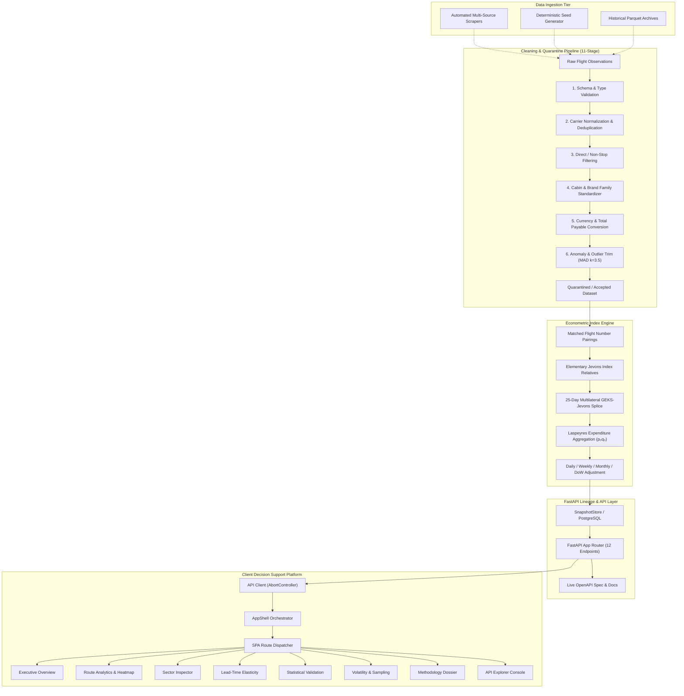
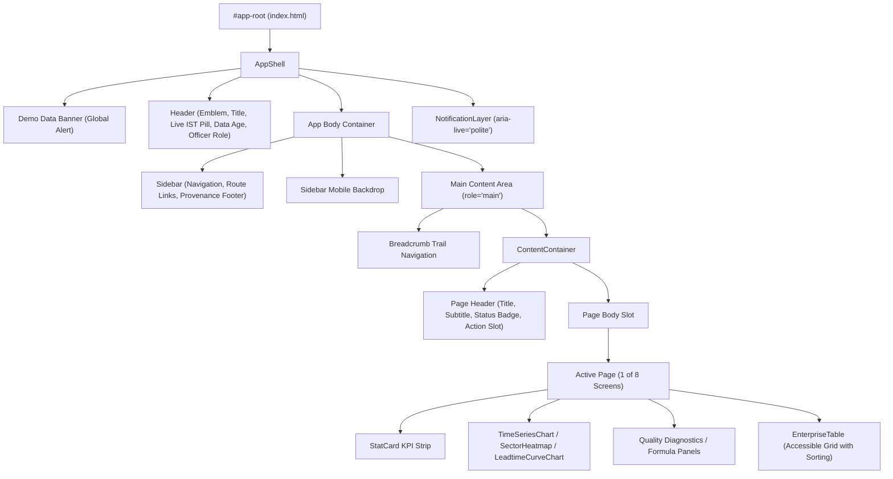
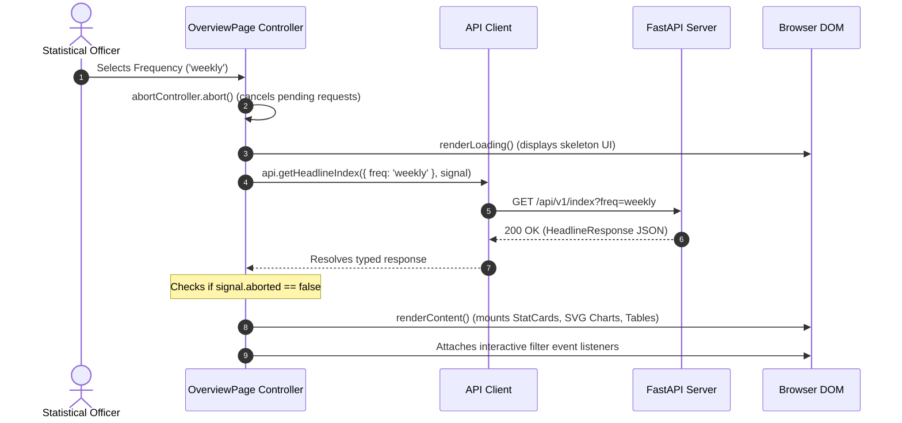

# AIPI System Architecture & Technical Design

**Airfare Price Index for India (AIPI)**  
*Smart India Hackathon 2026 · Problem Statement 26056 · Ministry of Statistics and Programme Implementation (MoSPI)*

---

## 1. Executive Architecture Summary

The AIPI platform is an institutional-grade, real-time decision support system engineered to collect, clean, validate, calculate, and publish a daily price index for Indian domestic civil aviation. It is designed to satisfy the statistical rigor expected of candidate Consumer Price Index (CPI) components by international bodies (IMF, ILO, Eurostat).

The system consists of three decoupled, highly cohesive tiers:
1. **Econometric Ingestion & Calculation Engine (Python)**: Implements 11-stage cleaning, elementary Jevons matching, 25-day rolling GEKS-Jevons multilateral aggregation, and Laspeyres expenditure-weight upper aggregation.
2. **API & Lineage Service (FastAPI / ASGI)**: Exposes strictly-typed, read-only REST endpoints with uniform error envelopes, provenance stamping, and zero-mock dataset contracts.
3. **Institutional Decision Support Frontend (Native ES / TS)**: Client-side single-page application built on a modular design token system, native SVG charting, accessible tabular numeral tables, and robust request cancellation lifecycle.

---

## 2. End-to-End System Architecture



---

## 3. Backend Architecture

### 3.1 Core Econometric Pipeline
The backend is structured into modular Python packages under `aipi/`:

- **`aipi/basket.py`**: Defines the 12 representative domestic routes accounting for the dominant share of domestic seat-kilometers (DEL-BOM, BOM-BLR, DEL-BLR, DEL-CCU, DEL-MAA, BOM-GOI, etc.) and specifies the `OBSERVATION_UNIT`:
  - 1 Adult passenger
  - Economy cabin
  - Non-stop routing
  - Lowest fare within brand family
  - Total payable fare in INR (inclusive of all mandatory fees and taxes)
  - Excluding codeshare duplicates and baggage ancillaries
- **`aipi/cleaning/`**: Executes an 11-stage quarantine pipeline that produces exact row-accounting metrics (input rows vs accepted index-eligible rows).
- **`aipi/index/elementary.py`**: Computes elementary Jevons price relatives $I_{J} = \prod (p_t / p_0)^{1/n}$ on matched items rather than geometric means of price levels.
- **`aipi/index/geks.py`**: Solves transitivity and eliminates chain drift using the multilateral GEKS formula:
  $$I_{GEKS}^{0,t} = \prod_{k \in W} \left( I_{J}^{0,k} \cdot I_{J}^{k,t} \right)^{1/|W|}$$
  on a 25-day rolling window with an unrevised movement splice.
- **`aipi/index/aggregate.py`**: Aggregates elementary cell indices up to the national headline index using base-period expenditure weights $w_r = \frac{p_{r,0} q_{r,0}}{\sum_k p_{k,0} q_{k,0}}$.
- **`aipi/validation/`**: Performs statistical back-testing against DGCA historical benchmarks and Monte Carlo sparse-sampling error simulations.

### 3.2 Store Protocol & Memory Snapshots
The API relies on the `IndexStore` abstract protocol (`aipi/store.py`). In standalone demo or development mode, `SnapshotStore` executes the econometric pipeline once at startup into an in-memory cache, providing zero-latency reads with zero external database dependencies. In production enterprise mode, `SqlStore` reads immutable published index vintages from PostgreSQL.

---

## 4. Frontend Architecture

### 4.1 Dual ES Module & TypeScript Architecture
The frontend utilizes a modern dual architecture:
1. **Browser Runtime**: Native ES Modules executed directly by modern browsers via `<script type="module" src="src/app.js">` without requiring bundling steps during runtime.
2. **Type Safety & Build Verification**: Parallel TypeScript definitions (`src/**/*.ts`) and `tsconfig.json` enabling strict type checking (`tsc --noEmit`) to eliminate runtime typing defects.

```
dashboard/src/
├── api/
│   ├── client.js / client.ts       # Normalized HTTP client with AbortController
├── types/
│   ├── api.ts                      # Backend Pydantic schema representations
│   └── navigation.ts               # SPA routing & breadcrumb models
├── components/
│   ├── AppShell.js / .ts           # Master layout shell with drawer & banners
│   ├── Header.js / .ts             # Topbar with live IST status & data age
│   ├── Sidebar.js / .ts            # Collapsible navigation & provenance footer
│   ├── ContentContainer.js / .ts   # Accessible page wrapper & header manager
│   ├── StatCard.js / .ts           # Institutional KPI metric card
│   ├── TimeSeriesChart.js / .ts    # Native SVG time-series chart with crosshair
│   ├── SectorHeatmap.js / .ts      # 2D SVG sector-date dispersion heatmap
│   ├── LeadtimeCurveChart.js / .ts # Advance purchase elasticity yield curve
│   ├── EnterpriseTable.js / .ts    # Sortable, filterable, accessible data table
│   ├── ErrorState.js / .ts         # Standardized error card with retry flow
│   ├── EmptyLayout.js / .ts        # Multi-variant empty state container
│   ├── LoadingLayout.js / .ts      # High-density skeleton loader
│   └── NotificationLayer.js / .ts  # WCAG accessible toast notification system
├── pages/                          # All 8 feature screens
├── styles/                         # Design token system (tokens, layout, global.css)
└── utils/                          # HTML escaping, DOM builders, number formatters
```

---

## 5. Component Hierarchy & Layout



---

## 6. Request Lifecycle & State Management

### 6.1 Safe Async Lifecycle & Race Condition Elimination
Every page controller maintains an isolated `AbortController` instance. When a user navigates between views or updates a date/frequency filter:
1. Any in-flight HTTP request from the previous state is immediately cancelled via `this.abortController.abort()`.
2. A new `AbortController` is instantiated and its `signal` is passed down to `api.client`.
3. If an aborted signal returns, the catch block silently ignores the `AbortError` without triggering false error states or mutating active DOM.
4. The page renders high-density skeleton placeholders during fetching.
5. On resolution, UI components re-render strictly from the verified JSON response.



---

## 7. Error Handling & Resilience Matrix

| Failure Condition | Backend Response | Frontend Catch & Handling | UI Representation |
| :--- | :--- | :--- | :--- |
| **API Down / Network Failure** | Network Timeout / Connection Refused | Handled via `ApiError(500, 'network_error')` | Standardized `ErrorState` card with "Retry Connection" action button. |
| **Unknown Sector Code** | HTTP 404 (`{"error": "unknown_route", "detail": "..."}`) | Intercepted in `RouteDetailPage` | Specialized Not Found screen with "← Back to Route Analytics" action. |
| **Invalid Filter Parameter** | HTTP 422 (`{"error": "invalid_request", "detail": "..."}`) | Intercepted in `api.client` | Error notification toast and retryable card without application crash. |
| **Cold Startup / Index Warming** | HTTP 503 (`{"error": "not_ready", "detail": "..."}`) | Intercepted in all page controllers | Informative "No index data available yet" state with retry trigger. |
| **Empty Filter Date Range** | HTTP 200 with empty points array | Handled in chart & table components | Native SVG empty state fallback: "No time-series data available for range". |

---

## 8. Security Architecture

1. **Deterministic HTML Sanitization**: All dynamic strings (route codes, sector names, run IDs, error descriptions, and parameters) pass through `escapeHtml()` prior to DOM insertion, preventing Cross-Site Scripting (XSS) and attribute injection.
2. **Strict Read-Only Surface**: The client application executes only non-mutating HTTP `GET` requests against the calculation engine.
3. **No Secret Leaks**: Client code contains zero hardcoded API keys, bearer tokens, or internal database credentials.
4. **CORS Isolation**: The FastAPI backend validates permitted cross-origin domains via `CORSMiddleware`.

---

## 9. Accessibility Architecture (WCAG 2.1 AA)

1. **Screen Reader Landmarks**: Semantic HTML5 markup (`<header>`, `<aside>`, `<main>`, `<nav>`, `<section>`, `role="region"`, `role="status"`).
2. **SVG Chart Accessibility**: Every vector chart (`TimeSeriesChart`, `LeadtimeCurveChart`, `SectorHeatmap`) is paired with an invisible, screen-reader accessible HTML data table (`.sr-only`) containing complete tabular numeral data.
3. **Keyboard Focus Management**: On client-rendered SPA view transitions, focus is automatically moved to the target heading (`.page-title` with `tabindex="-1"`), enabling immediate announcement by assistive technologies.
4. **Accessible Tables**: Enterprise tables feature `tabindex="0"` on sortable column headers, dynamic `aria-sort="ascending|descending|none"`, and customizable `aria-label` descriptions.
5. **Reduced Motion Support**: Respects `@media (prefers-reduced-motion: reduce)` by disabling shimmer animations and forcing instantaneous CSS transitions.
